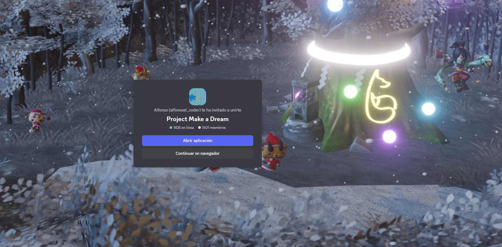

    
    
    
    

# Yo-kai Watch Busters 2: Traducción al Español (Nueva Versión)

¡Bienvenido al repositorio de la **nueva traducción al español** de *Yo-kai Watch Busters 2*! Este proyecto tiene como objetivo ofrecer una experiencia completamente traducida y pulida para los jugadores hispanohablantes.

El trabajo se basa en el increíble parche al inglés creado por la comunidad, así como en la traducción original al español realizada por [ENOCH-VK](https://github.com/ENOCH-VK), buscando refinarla y actualizarla para que sea lo más completa y fiel posible.

# Importante
🚧 **Este proyecto se encuentra actualmente en desarrollo.** 🚧

Si encuentras algún error de traducción, texto sin traducir, o cualquier problema durante la instalación, por favor, abre un [**issue**](https://github.com/AstralCoder48/New-YWB2_ES-Translation/issues) para que podamos solucionarlo lo antes posible.

# Instalación
Descarga el archivo de la última versión desde la sección [***Releases***](https://github.com/AstralCoder48/New-YWB2_ES-Translation/releases). El método de instalación varía dependiendo del emulador o si utilizas consola.

### Citra
1.  Asegúrate de tener la ROM asignada en el emulador.
2.  File -> Install CIA y selecciona el archivo de la traducción.

### Nintendo 3DS y 2DS:
1.  ...

# Créditos
Este proyecto no sería posible sin el esfuerzo y la dedicación de la comunidad. Un agradecimiento especial a:

-   **Equipo del Parche al Inglés:** Por el trabajo de ingeniería inversa y la base para la traducción. ([Mod original en GameBanana](https://gamebanana.com/mods/595774))
-   **ENOCH-VK:** Por la primera y fundamental traducción al español que sirve como pilar para este proyecto. ([@ENOCH-VK](https://github.com/ENOCH-VK) | [Repositorio Original](https://github.com/ENOCH-VK/YWB2_ES))

# PROJECT MAKE A DREAM
**Make a Dream** es un servidor de Discord que funciona como un punto de encuentro para la comunidad hispanohablante de Yo-kai Watch. En él encontrarás soporte para este y otros proyectos de traducción, discusiones sobre la saga, mangas traducidos y fan-games creados por la comunidad.

Si tienes cualquier duda o simplemente quieres pasar un rato agradable, ¡te esperamos!

> 

